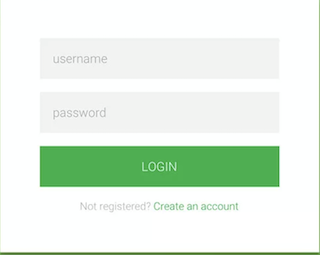
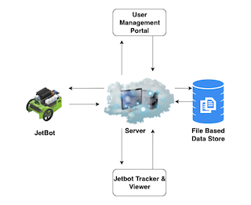
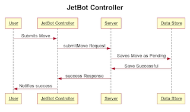
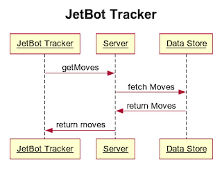
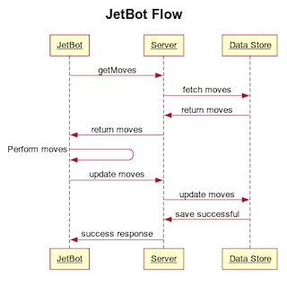

# Introduction

In this lab we're going to connect our jetbot to a web-server. We'll create a web controller so that you can control you bot remotely. We'll also create a Web Application(JetBot Tracker) which visualizes all the moves your bot has made.  

# Part 0: Server Setup

By now, you should know how to setup a Pyramid Server in a Docker Container. The below parts assume that you have a pyramid server up and running and you know how to develop basic web-pages and simple APIs.

# Part 1: User Management 

In this part, we'll build a basic User Management Portal which we'll eventually use to secure our JetBot. This should also warm you up for the main objectives of this lab (Part 2).

We need to save `User` details to a data-store. We need to store the following fields for a `User` - `userId, password, status` where status is `Pending | Verified | Voided`. A new user is created with status as `Pending`. New users can be verified from the admin portal and their status will become `Verified`. Existing user's access can be revoked from the admin portal by changing its status to `Voided`. For now, we'll use a File based storage as our data store and we'll write the data to a file named `users`.  We'll be reading and writing our moves data to this file. Each line in the file should store a single user object preferably in `json` format.

We'll build the following pages - 

1. Sign Up - A simple form which can be used to sign up to the portal.  When a user signs up, a user is created with status as `Pending`. The password can be only alphanumeric and We need a client-side check to validate the same. An error message should be shown if the password is not alphanumeric.
2. Sign In - A simple form which will be used to log-in to the portal. Only if the `userId` and `password` are valid and the status is `Verified`, the user should be allowed to log-in. An error message should be shown otherwise. A succesful login should take you to the Admin Portal.
3. Admin Portal - A portal accessible only by admins which will be used to `Confirm` new users (Change status from `Pending` to `Verified`) or `Void` existing users(Change status from `Verified` to `Voided`) to revoke their access. It should display the list of users and a button corresponding to the action that can be performed on the user. Confirm option should be visible only for Pending users and similarly Void option should be visible only for Verified users. Voided users should not be shown. 

For the above pages, we'll need the following APIs - 

1. `signUp(userId,password)`: It should save the `User` object(`userId, password, status`) in our data-store(a File) in `json` format. The status should be set as `Pending`. Simply return a boolean based on whether you were able to successfully save the user details or not. 
   
    **Request**: `{"userId" : "savyas", "password": "woohoo"}`

    **Response**: boolean
2. `login(userId,password)`: It should return a boolean based on whether the login request can proceed or not.
   
    **Request**: `{"userId" : "savyas", "password": "woohoo"}`

    **Response**: boolean
3. `getUsers`: It should return a list of all Users which can be displayed on the admin page.
       
    **Response**: `{"users": [{"userId" : "savyas", "status": "Pending"}, {"userId" : "ramsin", "status": "Verified"}, {"userId" : "rick", "status": "Verified"}]}`

4. `updateUserStatus(userId, status)`: It should update the status of the passed `userId` with the passed `status`. Return a boolean based on whether you were able to update the user status. This will be used by the admin portal.
   
    **Request**: `{"userId" : "savyas", "status": "Verified"}`

    **Response**: boolean

> In our case, The response will mostly be `true` unless we get some exception while writing to the file which should not happen.

Make sure to test all your pages and different use-cases.

# Part 2: Bot Controller and Viewer 

Now that we've made sure that our server and APIs are stable and we've warmed up our web-development skills, It's time to get down to business!! Now, We'll build a web controller to remotely control our bot and also a Tracker which will show all the moves made by the bot(and the details) all in Real Time!! 

There are three major components we need to build in this part - 

1. JetBot Tracker - A Web Page where you can view all the moves made by your JetBot.
2. JetBot Web Controller - A Secured Web Page using which you can control your JetBot.
3. JetBot Moves Poller - A component which will run in your JetBot and poll for any moves submitted by your Web Controller.

 After Logging in, there should a small portal which give a user to choose among the three options - Admin Portal, JetBot Tracker & JetBot Controller. [A simple page three buttons with some heading would do.]

These are the steps you generally follow when desigining a Full Stack Application -

## Formulate Requirements

We need to think about the requirements and all the functionality required by our application. It is essentially listing down all the use-cases of your application and based on that we'll design our application. 

### JetBot Tracker

In the tracker application, We need to display all the moves made by the bot in a nice view. This page should be secured in the sense that it should be accessible only after signing in.

Just to give you an idea on why this is important, Here are a couple of User Stories for this page - 

1. As a user, I should be able to see all the moves and its details(time, user, direction etc.) made by the JetBot. [This creates a requirement in our application to save and persist all the moves made by the bot in some data store.]
2. As a user, I should be able to see the updated move list as JetBot moves in real time. [This creates a requirement in our application to periodically fetch the list of all the moves asynchronously]
3. As a user, I should be able to see my username on the page.   

So to summarize, this page should display all the moves made by the jetbot and also periodically poll for any new moves and lastly, also display the userId of the user.

We can also provide a refresh button to force refresh the list of moves(Optional).

### JetBot Controller

Similar to JetBot Tracker, 
* It should be secured. 
* It should display the name of user and 
* It should allow the User to submit a move which should be somehow relayed to the JetBot. [ This creates a requirement in our application for some sort of shared data store between our web application and the JetBot] 

### JetBot Moves Poller

Not all components need to be User Facing. This is a critical component which will run in your JetBot and periodically fetch any pending moves to be made by the JetBot. It should also inform the Data Store when the move has been completed successfully. 

## Data Modeling

Now, there will be multiple APIs that we'll need to complete this part. However, before we jump into that, we need to define a concrete structure for our data so that it can reused across APIs. We need to model the data that we'll need to save for a `Move`. 

**Note:** This translates to defining the schema in the database world

We need to save atleast the following for a Single Move - 
   1. `moveId` - a unique identifier 
   2. `initiateTime` - timestamp when the move was initiated from the Controller. It is a good practice to store timestamps as epochs and we'll follow that here.
   3. `startTime` - timestamp when the move was started by the JetBot.
   4. `endTime` - timestamp when the move was completed by the JetBot.
   5. `direction/angle` - `left | right | forward | backward` - The direction in which the move was made. 
   6. `userId` - The user who initiated the move. This will be the id of the user who initiated the move from the Web Controller. We also need to handle the case when the move was initiated by the bot itself(Collission Avoidance!!). In this case, the userId should be `self`.
   7. `status` - The current status of this particular move. It can take the following values - `Pending | Completed`. You might be wondering what is the use of this field. It will become more clear when we start designing our APIs.

Feel free to add more fields as you see fit but try not to store redundant information. For example - if you need to show the move duration somewhere, you need not add another `duration` field as it can be evaluated from `startTime` & `endTime` fields. 

## Data Store Selection

After Data Modeling, The next step is to select a suitable database for our application based on the structure of the data we need to store, read and write query patterns & cost constraints. But, since we haven't unlocked the database skill yet, similar to part 1, we'll use a File Based Storage here too. We'll store our moves in a file called `moves` in the same directory. We'll be reading and writing our moves data to this file. Each line in the file should store a single move object preferably in `JSON` format.

## API Design

Now that we have formulated our requirements and defined our data model, The next step is to come up with APIs and their **Interface**[See Note] which our client side applicatons(Web Apps and JetBot) will use. The APIs should be generic and reusable for different scenarios. There are usually multiple ways you can model your APIs and it's a good mental exercise to come-up with your own Model. For now, We are providing you you one good model. We need the following APIs in order to get all our components functioning - 

> Note: You'll see Interface being mentioned at multiple places(For APIs, Classes etc.). Essentially, It's defining the Request and Response Structure of your API/method etc. It also includes defining the Exception Scenarios and you API's behavior in such cases. For example - `@throws UserNotFoundException if the userId(in Request) is invalid`

1. `submitMove({move: Move}): {success: boolean}` : This API should take input a `Move` object and return a boolean `success` based on success of storing the move details in the data-store. This API will be used by the Controller app to submit the moves.

    **Request** : A `json` object having a single field named `move` corresponding to the Move details. For Example, it may look something like- `{"move": {"moveId": "3", startTime: 12367123, direction: "left", "userId":"savyas", "status": "Pending"}}`

    **Response**: A success boolean based on success of storing the move details in the data-store. For example - `{"success": "true"}`

    > In our case, it will mostly be `true` unless we get some exception while writing to the file. 

2. `getMoves({"status": "Completed" | "Pending"}): {"moves": Move[]}` : This API should return all the moves with the `status` passed in the Request which is same as the status we defined for a `Move`(`Pending | Completed`). Think about why we need to pass the status in the request and where all will it be used. 
    
    **Request** : A `json` object having a single field named `status`. For Example - `{"status": "Completed"}`

    **Response**: A `json` object having a single field named `moves` containing a list of `Move` object in `json` format. For Example, it may look something like -  `{"moves": [{"moveId": "1", startTime: 12367123, direction: "left", "userId":"savyas", "status": "Completed"}, {{"moveId": "2", startTime: 12367823, direction: "right", "userId":"savyas", "status": "Completed"}}] }`

3. `updateMoveStatus` - It is left as an exercise for you to think why this API is required and what will be its interface. 

## UX Design

Usually, the next step is UX design which is essentially defining the User Interface(Developing some UI Mockups/Layouts to visualize how your application will look like) and User Interactions (Defining User Behavior and Changes. For example - Clicking on Left button submits the Move to make the robot move in left direction.) 

In our case, We have two User Facing pages we need to develop - JetBot Controller & JetBot Tracker. You can get creative here and It is upto you to define the UI layout for both the pages. It need not be fancy but we do expect some basic styling to be present and all the requirements should be achievable.

## Overall Architecture and Flow

## Implementation

Now that we're done with the design of our various components and know how will they interact with each other, It's time to code!! Implement all the components discussed above. Make sure to test all possible flows and use-cases you can think of.

## Bonus Extensions

* Modify Your APIs to handle multiple JetBot Scenario. This can be achieved by assigning each JetBot an id `jetBotId` and storing it as part of your `Move` structure. You should be able to submit a move to multiple JetBots in the Controller application(possibly by having an input field for `jetBotId`) and also view the moves of an individual JetBot or all the JetBots in the Tracker application. Your `getMoves` API would also need a filter on the `jetBotId` field so that a jetbot can fetch moves only relevant to its corresponding id.
* After Initiating a move from the controller, Display a Success message when the move has been successfully completed by the JetBot. You may need to add additional API to fetch a move details based on `moveId`. Note that this is different from the previous `success` which was just a success based on whether the save to data store was successful or not.
* Make your APIs secure by adding a userId field in your request and model and check whether the userId is valid or not.
* Handle multiple clicks & parallal requests - In JetBot Controller, A user may click a button multiple times even when a request is in progress and this would submit multiple requests to your server. We should try to avoid such parallal requests scenarios and should ideally disable any user interaction when a request is in progress. It is also a good UX choice to show some type of loader or a message which conveys the user that the request is currently under process and the application is not frozen and you need not smash your keyboard!!
